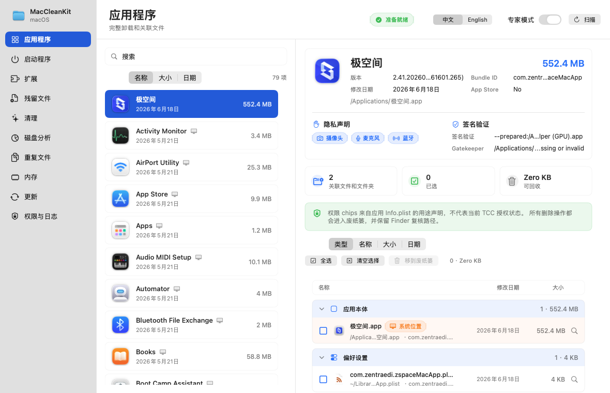

# MacCleanKit



## 中文介绍

MacCleanKit 是一个 macOS 原生清理与应用管理工具原型，使用 SwiftUI 和 AppKit 构建。它面向需要复核应用残留、启动项、扩展、缓存、日志、重复文件和磁盘占用的用户，强调“先展示、再确认、只移到废纸篓”的安全工作流。

作者：Linux do @MIKE2026

当前版本支持中文 / English 双语切换，包含应用程序扫描、关联文件分析、启动项禁用与恢复、系统文件区分、权限与日志页面、重复文件扫描、磁盘分析、内存状态查看、本地打包、DMG 生成和发布检查脚本。

> 注意：MacCleanKit 仍是 MVP / prototype，不是生产级清理数据库。请在移动文件到废纸篓前仔细复核路径和项目来源。

MacCleanKit is a native macOS cleanup and application management prototype built with SwiftUI and AppKit.

The product direction references the feature set of Nektony's Mac cleanup utilities:

- MacCleaner Pro: cleanup, speed-up, disk analysis, duplicates, memory tools.
- App Cleaner & Uninstaller: complete app removal, leftover files, startup items, extensions, update overview, and app security hints.

This project is not affiliated with Nektony and does not copy its branding or assets.

## Current Features

- Chinese / English in-app language switch.
- Native two-pane macOS utility UI inspired by an app manager workflow.
- Lightweight initial app scan: the app list appears quickly and fills precise bundle sizes in the background.
- Installed app scanner for `/Applications`, `/System/Applications`, `/System/Applications/Utilities`, and `~/Applications`.
- Per-app associated file discovery:
  - app bundle
  - `~/Library/Application Support`
  - `~/Library/Caches`
  - `~/Library/Preferences`
  - `~/Library/Logs`
  - `~/Library/Containers`
  - `~/Library/Group Containers`
  - `~/Library/HTTPStorages`
  - `~/Library/WebKit`
  - LaunchAgents / LaunchDaemons
- Code signing and Gatekeeper assessment for the selected app.
- Privacy declaration chips from `Info.plist` usage-description keys.
- Startup item scanner for LaunchAgents and LaunchDaemons.
- Startup items show the real referenced app/executable icon when it can be resolved.
- Extension scanner for Safari, Chrome, Edge, Firefox profile roots, Internet Plug-Ins, PreferencePanes, QuickLook, Spotlight, Audio Plug-Ins, and system extensions.
- Leftover scanner using Bundle ID heuristics.
- Cleanup scanner for user caches, logs, downloads archives, screenshots, Mail downloads, Xcode DerivedData / Archives, and Trash.
- Disk usage analyzer for common user folders and `/Applications`.
- Duplicate finder for Desktop, Documents, and Downloads using file size plus SHA-256.
- Memory pressure view with optional system `purge` call when available.
- Local update overview using App Store receipts and app modification dates.
- Automatic MacCleanKit update detection through GitHub Releases, with optional Sparkle support for signed appcast builds.
- All destructive operations move files to Trash and require confirmation.
- Permission status page for Full Disk Access troubleshooting.
- First-run Full Disk Access onboarding.
- Cancellable scan tasks with visible scan stage/progress.
- Timeout protection for external system tools such as `du`, `codesign`, `spctl`, `launchctl`, and `purge`.
- Deletion protection for system paths, Apple core apps, running apps, and unknown large folders.
- File rows distinguish user locations from system-level locations before removal.
- Persistent Trash operation log in `~/Library/Application Support/MacCleanKit`.
- Startup item disable/restore flow with local backups and `launchctl` status hints.
- Rule-based associated-file discovery via `Sources/MacCleanKit/Resources/RemovalRules.json`.
- Persistent size cache in `~/Library/Application Support/MacCleanKit/size-cache.json`.
- Duplicate auto-selection policies for keep newest, keep shortest path, and keep dominant folder.
- Duplicate scan pipeline: size grouping, sample hash, then full SHA-256.
- Browser extension manifest parsing for clearer names and versions where available.
- Single-source Chinese / English localization table in code to avoid launch-time bundle lookup stalls.
- Imagegen-based app icon source, `.icns` generation, DMG packaging, Developer ID notarization, and Sparkle appcast scaffolding scripts.
- Launch smoke test for packaged `.app` window visibility and internal UI screenshot export.
- User-extendable rule file at `~/Library/Application Support/MacCleanKit/RemovalRules.json`.

## Run

```bash
swift run MacCleanKit
```

## Build

```bash
swift build
```

## Self Test

The installed Command Line Tools environment does not provide `XCTest` or Swift Testing, so this project uses an app-level self-test:

```bash
Scripts/run-tests.sh
```

Set `SKIP_UI_SMOKE=1` when running in a headless environment.

## Package `.app`

```bash
chmod +x Scripts/package-app.sh
Scripts/package-app.sh
```

The packaged app is written to:

```text
dist/MacCleanKit.app
dist/MacCleanKit.app.zip
dist/MacCleanKit.dmg
```

The script uses ad-hoc signing for local testing. For distribution, use Developer ID signing and Apple notarization. See `docs/DISTRIBUTION.md`.

If a downloaded build shows macOS's "damaged and can't be opened" warning, it was not notarized. Testers can remove quarantine with `xattr -dr com.apple.quarantine /Applications/MacCleanKit.app`, but public releases should be Developer ID signed and notarized.

## Release Check

```bash
Scripts/release-check.sh
```

This runs build/self-test, packages the app, verifies the `.app` can open a visible window, exports a UI screenshot, builds the DMG, and generates an appcast template.

## Safety Notes

- This is an MVP, not a production-grade cleaner database.
- App leftovers are inferred from Bundle IDs and common macOS Library paths; review before deleting.
- Built-in rules improve matching for some common apps, but they are still review-first rules.
- Custom rules can be added in `~/Library/Application Support/MacCleanKit/RemovalRules.json`; invalid or unsafe rules are ignored.
- Permission chips come from declared `Info.plist` usage strings, not the protected TCC database.
- MacCleanKit's own update card checks the public GitHub Releases API. The installed-app update list does not contact third-party vendor servers; it only distinguishes App Store apps, recently modified apps, stale apps, and manual-check candidates.
- Sparkle auto-update is optional. It activates only when `SUFeedURL` and a public EdDSA key are supplied during packaging and the Sparkle framework is vendored/linked in a distribution build.
- Moving active app caches or plugins can affect running apps. Quit related apps before cleaning.
- Disk analysis is read-only.

## 致谢

感谢 [linux.do](https://linux.do/) 社区的讨论、反馈和支持。

## License

MacCleanKit is released under the MIT License. See `LICENSE`.
